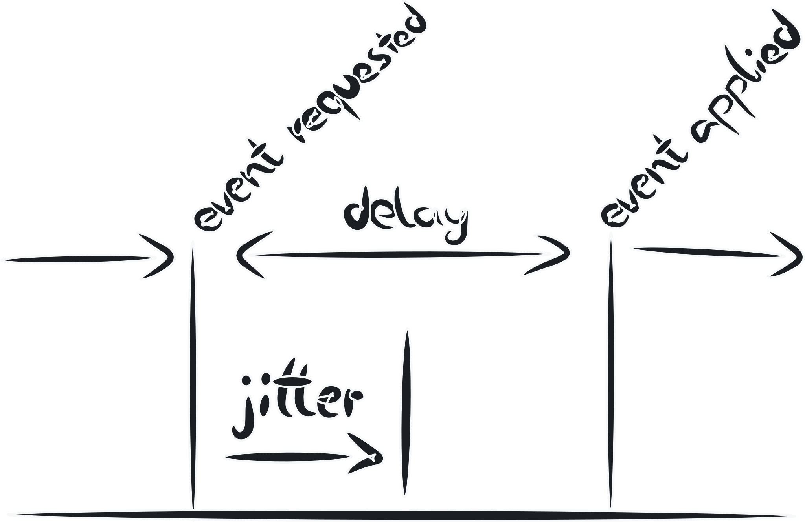
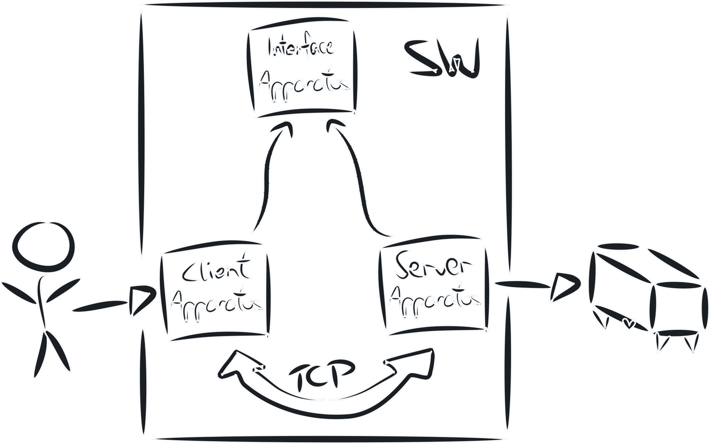
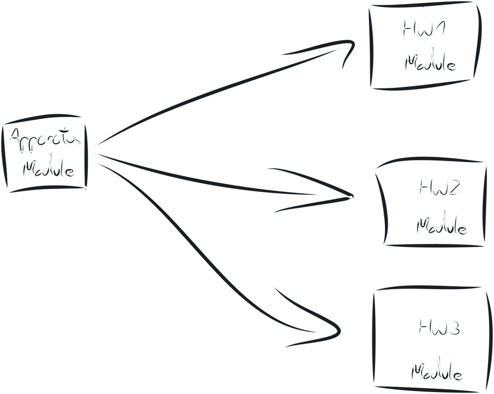

# Firmware concepts

## Time synchronization

To keep the outputs of the apparatuses in sync, we use the commonly built-in operating system NTP time synchronization feature, as it seemed to synchronize the clocks accurately enough so that synchronized presentation of light and sound is indistinguishable in sync between the apparatuses.

To eliminate network jitter, all commands have an execution time selected by the client/controller PC that is `delay` in the future. The apparatuses then execute the command when the provided timestamp is reached. In operation, this way, network jitter smaller than `delay` is eliminated as seen below:



## Interfaces

A common interface was developed to ease development and make reading the source code easier. In practice, both the server and the apparatus inherit from the same interface definition file and then implement the network handling separately.



## Modular development

As far as possible, the firmware was developed with object-oriented software development in mind. This way, each hardware module is implemented in its own class that is then included in a parent class that makes swapping or extending functionality easier.



## Event logging

The session data recording is event-based. This means that every input and output is logged in a time series-like CSV file similar to this. Please use the below example to get an impression of how the raw data looks like and can be interpreted:

```csv
timestamp,[...],session_nr,trial_nr,event_side,side_risky,event_id,event_state
TRIAL NUMBER CHANGED
2021-07-06 14:26:28.927625,[...],2,1,NA,LEFT,BEGIN_TRIAL,NA
TRIAL SEQUENCE
2021-07-06 14:26:30.932709,[...],2,1,BOTH,LEFT,LEVER_OPEN,True           <- LEVER UNLOCKED
2021-07-06 14:26:30.932934,[...],2,1,BOTH,LEFT,TEST_LIGHT,True           <- DECISION AVAILABLE
2021-07-06 14:26:33.519492,[...],2,1,RIGHT,LEFT,LEVER_TOUCHS_IO,True
2021-07-06 14:26:33.519492,[...],2,1,RIGHT,LEFT,LEVER_TOUCHS_IO,False
2021-07-06 14:26:33.519492,[...],2,1,RIGHT,LEFT,LEVER_TOUCHS_IO,True
2021-07-06 14:26:33.668759,[...],2,1,RIGHT,LEFT,LEVER_SWITCH_IO_UP,False <- PULL_STARTED
2021-07-06 14:26:33.788517,[...],2,1,RIGHT,LEFT,LEVER_SWITCH_IO,True     <- DECISION MADE
2021-07-06 14:26:33.837875,[...],2,1,BOTH,LEFT,LEVER_OPEN,False          <- LEVER LOCKED
2021-07-06 14:26:33.968759,[...],2,1,RIGHT,LEFT,LEVER_SWITCH_IO,False
2021-07-06 14:26:34.068759,[...],2,1,RIGHT,LEFT,LEVER_SWITCH_IO_UP,True  <- LEVER BACK IN START POSITION
2021-07-06 14:26:34.124312,[...],2,1,RIGHT,LEFT,LEVER_TOUCHS_IO,False    <- HAND REMOVED FROM LEVER
TRIAL LOGIC INFORMATION
2021-07-06 14:26:34.417257,[...],2,1,RIGHT,LEFT,NO_FAIL_RELEASE,True     <- LEVER RELEASE TIMEOUT 25s
2021-07-06 14:26:34.417683,[...],2,1,RIGHT,LEFT,LEVER_PULLED,True        <- TIMEOUT LEVER PULL
TRIAL SEQUENCE CONTINUED
2021-07-06 14:26:34.417767,[...],2,1,BOTH,LEFT,TEST_LIGHT,False          <- Testlight off time
```
